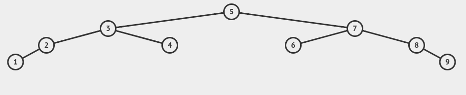

# Prática 1 
**Estudante:** Anderson Rodrigues dos Santos

## **Objetivo**

O trabalho tem como objetivo testar o conhecimento sobre árvores binárias discutidos na sala de aula.

O repertório do trabalho está disponível em: 
[**GitHub - Prática 1 - AEDs II**](https://github.com/AndersonR-S/Atividade_1_AedsII.git)

## Problema 1  
O problema 1 foi feito em **manuscrito**. O link para acessar as imagens está disponível abaixo:  

[**Problema 1**](Problema_1.pdf)  

## Problema 2  
O código do algoritmo encontra-se no repositório:  
[**GitHub - Prática 1 - AEDs II / Problema 2**](https://github.com/AndersonR-S/Atividade_1_AedsII/tree/main/Problema_2)

### 1 - Cálculo do Nível Máximo (Altura da Árvore)

    typedef struct No {
        int valor;
        No* left;
        No* right;
        No(int valor) : valor(valor), left(nullptr), right(nullptr) {}
    } No;

    int Tree::maxNivel(No* raiz) {
        if (raiz == nullptr) {
            return 0;
        } else {
            int size_left = maxNivel(raiz->left);
            int size_right = maxNivel(raiz->right);

            return size_left > size_right ? size_left + 1 : size_right + 1;
        }
    }

### 2 - Inserção e Remoção com Atualização da Altura

#### Inserindo um novo elemento:

    No* Tree::inserir(No* raiz, int valor) {
        if (raiz == nullptr) {
        raiz = new No(valor);
        }
        else if (valor < raiz->valor) {
            raiz->left = inserir(raiz->left, valor);
        } else {
            raiz-> right = inserir(raiz->right, valor);
        }
        return raiz;
    }

#### Removendo um  elemento:

    // Procurando o sucessor para o numero que será retirado
    No* Tree::sucessor(No* raiz) {
        No* aux = raiz;
        while (aux && aux->left != nullptr) {
            aux = aux->left;
        }
        return aux;
        }

    // Remover um elemento
    No *Tree::remover(No *raiz, int valor) {
        if (raiz == nullptr) {
            return raiz;
        }

        if (valor < raiz->valor) {
            raiz->left = remover(raiz->left, valor);
        } else if (valor > raiz->valor) {
            raiz->right = remover(raiz->right, valor);
        } else {

            // no com um ou nenhum filho
            if (raiz->left == nullptr) {
                No *aux = raiz->right;
                delete raiz;
                return aux;
            } else if (raiz->right == nullptr) {
                No *aux = raiz->left;
                delete raiz;
                return aux;
            }

            // no com dois filhos
            No *sucessor_minimo = sucessor(raiz->right);
            raiz->valor = sucessor_minimo->valor;
            raiz->right = remover(raiz->right, sucessor_minimo->valor);
        }
        return raiz;
    }

#### Visualização Interativa:

    vector<int> valoresInserir = {5, 3, 7, 2, 4, 6, 8, 90, 4 ,23, 245, 43 , 22, 45};
    for(auto &i : valoresInserir){
        raiz = t->inserir(raiz, i);
        cout<< "Altura da arvore: " << t->maxNivel(raiz) << endl;
    }
    cout<<endl;

    vector<int> valoresRemover = {3, 90, 245, 43 , 22};
    for(auto &i : valoresRemover){
        raiz = t->remover(raiz, i);
        cout<< "Altura da arvore: " << t->maxNivel(raiz) << endl;
    }
    cout<<endl;

### 3 - Análise de Crescimento:

- Conjunto 1: Árvore "Desbalanceada"
Utilizasse uma sequência crescente de números para representar a inserção em uma árvore desbalanceada. Os valores serão de 1 a 9:

        Conjunto 1 (desbalanceado): [1, 2, 3, 4, 5, 6, 7, 8, 9]

.

- Conjunto 2: Árvore "Balanceada"
Agora, escolhendo uma sequência de valores que resulta em uma árvore balanceada. Uma árvore binária balanceada pode ser construída a partir de uma sequência ordenada, escolhendo os elementos do meio em cada nível. Com isso, utilizaremos:

        Conjunto 2 (balanceado): [5, 3, 7, 2, 4, 6, 8, 1, 9]
    

.

**Tabela de Comparação das Árvores e Depreciação**

| Etapa de Inserção | Altura da Árvore Desbalanceada | Altura da Árvore Balanceada | Depreciação (%) |
|-------------------|-------------------------------|----------------------------|-----------------|
| 1                 | 1                             | 1                          | 0.00            |
| 2                 | 2                             | 2                          | 0.00            |
| 3                 | 3                             | 2                          | 33.33           |
| 4                 | 4                             | 3                          | 25.00           |
| 5                 | 5                             | 3                          | 40.00           |
| 6                 | 6                             | 3                          | 50.00           |
| 7                 | 7                             | 3                          | 57.14           |
| 8                 | 8                             | 4                          | 50.00           |
| 9                 | 9                             | 4                          | 55.56           |

Observações 

- A altura da árvore desbalanceada aumenta rapidamente à medida que as inserções são feitas em ordem crescente.
- A árvore balanceada, por sua vez, mantém uma altura mais constante devido ao processo de balanceamento durante as inserções.
- A depreciação, que mede o impacto negativo de não balancear a árvore, aumenta conforme a diferença de altura entre as árvores desbalanceada e balanceada se amplia.

Concluindo assim, que esta análise mostra a importância de balancear a árvore para reduzir o custo das operações de busca, inserção e remoção. Em cada etapa, a árvore balanceada mantém uma altura menor, o que resulta em maior eficiência.

### 4 - Caminho mais longo:

    void Tree::encontrarCaminhoMaisLongo(No* raiz, vector<int>& caminho, std::vector<int>& melhorCaminho) {
    if (raiz == nullptr) {
        return;
    }

    caminho.push_back(raiz->valor);

    if (raiz->left == nullptr && raiz->right == nullptr) {
        if (caminho.size() > melhorCaminho.size()) {
            melhorCaminho = caminho;
        }
    }

    encontrarCaminhoMaisLongo(raiz->left, caminho, melhorCaminho);
    encontrarCaminhoMaisLongo(raiz->right, caminho, melhorCaminho);

    caminho.pop_back();
    }
**Observações**

O desbalanceamento de uma árvore binária aumenta o comprimento do caminho da raiz até as folhas, tornando as operações (como busca, inserção e remoção) mais lentas. 
Em uma árvore desbalanceada, o caminho pode ser tão longo quanto o número de nós `n`, resultando em uma altura de `n-1`. Já em uma árvore balanceada, a altura é `O(log n)`, ou seja, o caminho até a folha mais distante é muito mais curto, tornando as operações mais eficientes. Portanto, o desbalanceamento prejudica o desempenho da árvore, aumentando o tempo de execução das operações.

## Problema 3
O código do algoritmo encontra-se no repositório:  
[**GitHub - Prática 1 - AEDs II / Problema 3**](https://github.com/AndersonR-S/Atividade_1_AedsII/tree/main/Problema_3)

### Dicionario.hpp/.cpp
O código é uma implementação de uma classe **Dicionario** em C++ que lida com a leitura de palavras de um arquivo e fornece sugestões de autocompletar com base em um prefixo. A classe utiliza uma estrutura de árvore (**tree**) para armazenar e buscar palavras.

#### Construtor da Classe **Dicionario**
O construtor da classe **Dicionario** inicializa o membro **root** como `nullptr` e chama a função **lendoArquivo** para carregar as palavras do arquivo especificado. Ele também mede o tempo necessário para carregar o dicionário e imprime essa duração.

#### Função `lendoArquivo`
A função **lendoArquivo** é responsável por ler palavras de um arquivo cujo nome é passado como argumento. Ela cria uma nova instância de **tree** e inicializa um ponteiro **raiz** para `nullptr`. Em seguida, abre o arquivo especificado e verifica se a abertura foi bem-sucedida. Se o arquivo não puder ser aberto, a função imprime uma mensagem de erro e encerra o programa. Caso contrário, a função lê cada palavra do arquivo e insere essa palavra na árvore usando o método `insert` da classe **tree**. Após a leitura de todas as palavras, o arquivo é fechado e a raiz da árvore é armazenada no membro **root** da classe **Dicionario**.

#### Função `sugestoes`
A função **sugestoes** recebe um prefixo como argumento e busca sugestões de palavras que começam com esse prefixo. Ela transforma o prefixo para letras minúsculas para garantir uma busca case-insensitive. Em seguida, utiliza o método `autocomplete` da classe **tree** para obter as sugestões e mede o tempo necessário para realizar a busca. As sugestões encontradas são impressas, e se nenhuma sugestão for encontrada, uma mensagem apropriada é exibida. Por fim, o tempo de busca é impresso.

### Tree.hpp/.cpp

O código fornecido implementa a classe **tree** e suas funções associadas para manipulação de uma árvore binária de busca, especificamente para inserção de palavras e busca de sugestões de autocompletar com base em um prefixo.

#### Construtor `tree`
O construtor **tree::tree()** é um construtor padrão vazio que não realiza nenhuma inicialização específica.

#### Função `insert`
A função **tree::insert** é responsável por inserir uma nova palavra na árvore binária de busca. Ela recebe um ponteiro para a raiz da árvore (**raiz**) e a palavra a ser inserida. O comportamento da função é o seguinte:
- Se a raiz for `nullptr`, significa que a árvore está vazia ou se chegou a uma posição onde a nova palavra deve ser inserida. Nesse caso, um novo nó é criado com a palavra.
- Se a palavra a ser inserida for **menor** que a palavra no nó atual, a função é chamada recursivamente para inserir a palavra na subárvore **esquerda**.
- Caso contrário, a função é chamada recursivamente para inserir a palavra na subárvore **direita**.

A função retorna o ponteiro para a raiz da árvore após a inserção.

#### Função `coletarSugestoes`
A função **coletarSugestoes** é uma função auxiliar que percorre a árvore binária de busca e coleta palavras que começam com um determinado prefixo. Ela recebe:
- Um ponteiro para a raiz da árvore (**raiz**)
- O **prefixo** a ser buscado
- Um vetor de strings (**suggestions**) onde as sugestões serão armazenadas.

Seu comportamento é:
- Se a raiz for `nullptr`, a função retorna imediatamente.
- Caso contrário, se a palavra no nó atual começar com o prefixo, ela é adicionada ao vetor de sugestões.
- A função então chama a si mesma recursivamente para percorrer as subárvores esquerda e direita.

#### Função `autocomplete`
A função **tree::autocomplete** utiliza a função **coletarSugestoes** para buscar palavras que começam com um determinado prefixo. Ela recebe:
- Um ponteiro para a raiz da árvore (**raiz**)
- O **prefixo** a ser buscado.

A função realiza os seguintes passos:
1. Cria um vetor de strings para armazenar as sugestões.
2. Chama a função **coletarSugestoes** para preencher esse vetor com as palavras que correspondem ao prefixo.
3. Retorna o vetor de sugestões.

### 1 - Desempenho e Otimizações
O processo de autocompletar, utilizando uma árvore binária de busca (ABB), depende consideravelmente da estrutura da árvore e da sequência em que as palavras são adicionadas. A eficiência na busca por palavras que compartilham um prefixo específico pode ser descrita da seguinte maneira:

- **Melhor Caso:** Quando a árvore está balanceada, a busca por palavras ocorre em tempo **O(log n)**, onde **n** representa o total de palavras no dicionário.
  
- **Pior Caso:** Em uma árvore desbalanceada, a busca pode piorar para **O(n)**, especialmente se a árvore se tornar linear (por exemplo, quando as inserções ocorrem de forma já ordenada).

### 2 - Desempenho e Otimizações

Árvores binárias de busca (ABB) podem se desbalancear à medida que mais dados são inseridos, o que afeta a eficiência das operações. Para garantir o desempenho mesmo com grandes volumes de dados, podemos usar técnicas de balanceamento e otimização de armazenamento.

**Árvores Balanceadas**

- **Árvore AVL**: Mantém o balanceamento rigoroso, garantindo que a altura da árvore seja **O(log n)**. Porém, as inserções e exclusões podem ser mais lentas devido às rotações.
- **Árvore Red-Black**: Mais flexível que a AVL, permitindo maior desbalanceamento, mas com operações de manutenção (rotação e recoloração) mais rápidas. Também garante **O(log n)** de complexidade nas operações.

**Otimização de Armazenamento**

- **Ponteiros Compactados**: Reduz o uso de memória ao compactar ponteiros ou usar índices para acessar nós.
- **Árvores B/B+**: Armazenam múltiplos valores por nó, reduzindo a altura da árvore e melhorando a eficiência em sistemas de disco ou com memória limitada.
- **Compressão de Dados**: Técnicas como **Huffman** podem ser usadas para reduzir o tamanho das palavras armazenadas.

**Conclusão**

- **Árvores AVL** são ideais quando a manutenção do balanceamento rigoroso é necessária.
- **Árvores Red-Black** são melhores para sistemas com inserções e exclusões frequentes, pois possuem manutenção de balanceamento mais eficiente.

Essas técnicas ajudam a garantir que a estrutura de dados permaneça eficiente e com baixo uso de memória, mesmo em cenários de grandes volumes de dados.

### 2 - Testes 

| **Tamanho do Dicionário (n)** | **Tempo de Inserção (s)** | **Tempo de Busca (s)** | **Observação**                                              |
|-------------------------------|---------------------------|-------------------------|-----------------------------------------------------------|
| 100                           | 0.00008954               | 0.00002343             | Tempo de execução rápido devido ao pequeno volume de dados. |
| 500                           | 0.01701010               | 0.00007868             | Inserção começa a mostrar variações devido ao aumento de dados. |
| 1.000                         | 0.00902968               | 0.00015448             | Busca ainda muito eficiente; tempo de inserção moderado.    |
| 10.000                        | 0.03054490               | 0.00152464             | A inserção começa a ser impactada pelo aumento no tamanho da árvore. |
| 100.000                       | 0.12774900               | 0.01039770             | Busca e inserção tornam-se mais lentas devido ao tamanho da estrutura. |

O código utiliza uma **árvore de busca binária (ABB)** para implementar o dicionário, permitindo inserções e buscas eficientes com complexidade média de \(O(\log n)\). A tabela apresentada ilustra os tempos de execução para inserção e busca em diferentes tamanhos de dicionário, mostrando que, à medida que o volume de dados cresce, os tempos também aumentam, mas permanecem práticos para tamanhos pequenos e moderados.  

- **Tempo de Inserção:** Para pequenos volumes de dados (como 100 ou 500 elementos), o tempo de inserção é quase instantâneo, com valores como 0.00008954 segundos para 100 elementos. No entanto, para 100.000 elementos, o tempo sobe para 0.12774900 segundos, evidenciando o impacto do crescimento do dicionário. Esse comportamento é característico de uma ABB, especialmente quando não está balanceada.  

- **Tempo de Busca:** A busca é bastante rápida para volumes pequenos (0.00002343 segundos para 100 elementos), mas se torna mais lenta à medida que o dicionário cresce, chegando a 0.01039770 segundos para 100.000 elementos. Isso ocorre devido ao aumento da profundidade da árvore, que impacta diretamente na eficiência da busca.  

**Justificativa:** A ABB é uma boa escolha para tamanhos moderados de dados, oferecendo tempos razoáveis de execução. No entanto, para grandes volumes de dados, o desempenho pode se degradar, já que árvores não balanceadas podem apresentar complexidade próxima de \(O(n)\). Alternativas como árvores balanceadas (e.g., AVL) são mais adequadas para garantir tempos consistentes, mesmo em cenários de maior escala.  

**Melhorias Previstas:**
1. **Uso de AVL:** Substituir a ABB por uma árvore AVL pode melhorar significativamente o desempenho tanto para inserção quanto para busca, já que a árvore permanece balanceada automaticamente.
2. **Cache de Prefixos:** Adicionar um cache para armazenar resultados de buscas frequentes pode reduzir o tempo de execução em cenários de repetição.
 
Em resumo, a ABB apresenta resultados eficientes para volumes moderados, mas para cenários de maior escala ou uso intensivo, ajustes estruturais ou mudanças para árvores balanceadas são recomendados para manter a eficiência.

## COMPILAÇÃO E EXECUÇÃO 

| Comando     | Função                                                                 |
| ----------- | ---------------------------------------------------------------------- |
| make clean  | Apaga a última compilação realizada contida na pasta build              |
| make        | Executa a compilação do programa utilizando o gcc, e o resultado vai para a pasta build |
| make run    | Executa o programa da pasta build após a realização da compilação       |

## AMBIENTE DE EXECUÇÃO
<table border="1">
  <tr>
    <th>Sistema Operacional</th>
    <td>Ubuntu 22.04.5 LTS x86_64</td>
  </tr>
  <tr>
    <th>Compilador</th>
    <td>G++ 12.2.0</td>
  </tr>
  <tr>
    <th>Hardware</th>
    <td>Intel i5-7300HQ (4) @ 2.500GHz, 8GB RAM, 1TB HD</td>
  </tr>
</table>

